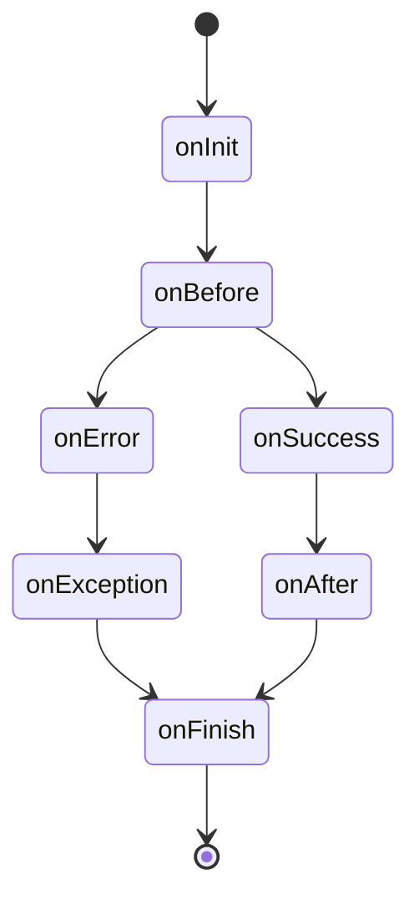

# Architecture

Restroom is a bunch of tools in form of [Expressjs](https://expressjs.com/) apps.

This allows you to be very flexible and adopt it also on existing codebase, by just plug the app in your server.

## Middleware

First make sure to read the [Using middleware](https://expressjs.com/en/guide/using-middleware.html) section of the Expressjs documentation.

By middleware we intend the same one explained by the Expressjs documentation:

!> Middleware functions are functions that have access to the request object (req),
the response object (res), and the next middleware function in the application’s
request-response cycle

The main purpose of middlewares is to bind new actions/operations to the Zencode contracts, that
are not already present into the [zencode command list](https://dev.zenroom.org/#/pages/zencode-list)

**eg.** If we need to store the result of the smart contract into a database, we will write a `database` middleware that interprets the following sentences

```gherkin
    Given that I have a valid database connection
    Then save the result into the database
```

and executes the correct releated operation.

## Building blocks

The main functionality relies on the [@restroom-mw/core](/packages/core) that reads a directory and exposes `POST`
endpoints on the fly, based on the content files of the directory.

The **@restroom-mw/core** also have a [hooking](https://en.wikipedia.org/wiki/Hooking) system that allows to other
apps/middlewares to interact with the lifecycle of the zenroom execution. _see the next section for details_

Optionally the [@restroom-mw/ui](/packages/ui) creates a openapi (_ex-swagger_) interface,
to interact with your contract directly from the browser, and also to generate API documentation
based on your contract files.

## Lifecycle hooks

In your middleware logic, you want to interact with the `core` execution of the contract.
Maybe by defining new operations or by parsing new sentences. This is possible by defining
some functions that are executed at some specific stage of the execution, a `hook`.

Each middleware could have some hooks, and if defined they are all executed, one after each other.



Each request made to a endpoint have this hooks.

#### onInit()

Is executed at the very begin of the request. Is a good idea to write your setup logic here, if needed.

#### onBefore(zencode)

Is executed just before the zenroom execution, but after that the contract is found. This stage is useful if you need to parse `Given` in your middleware

#### onSucess(result, zencode)

If the execution have no errors, this hook is fired with the result and the contract as params, this is where you want to put your `Then` logic

#### onAfter(result, zencode)

This stage is executed after the zenroom execution

#### onError(errors, zencode)

If there is some error in the execution contract, this hook is fired, that passes the errors in form of array of strings and the contract

#### onException(stderr)

This is fired when something bad happens

#### onFinish()

This is fired at the very end of the request, wich you want to use for clenup things
