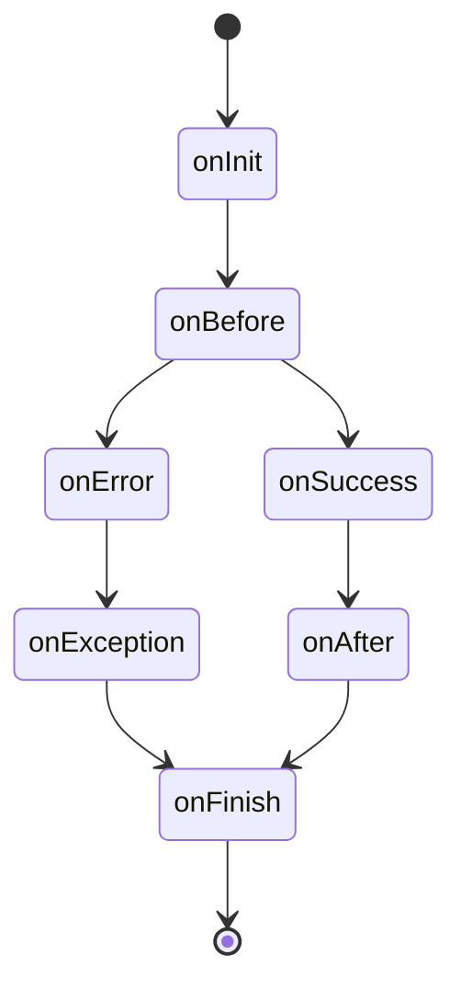

# Architecture

RESTroom is made of a set of components built on [Expressjs](https://expressjs.com/), making it very flexible and easy to plug into an existing codebase.

## Middleware

First **make sure to read the [Using middleware](https://expressjs.com/en/guide/using-middleware.html) section** of the Expressjs documentation.

Our concept of middleware is the same as the one explained in the Expressjs documentation:

!> Middleware functions are functions that have access to the request object (req),
the response object (res), and the next middleware function in the application’s
request-response cycle

The main purpose of middlewares is to **bind new actions/operations** to the Zencode contracts, that
are not already present into the [zencode command list](https://dev.zenroom.org/#/pages/zencode-list)

**eg.** If we need to store the output of a smart contract into a database, we can write a `database` middleware in RESTroom that interprets the following sentences:

```gherkin
    Given that I have a valid database connection
    Then save the result into the database
```

and then takes care of storing the data.

## Building blocks

The core functionalities are built inside the [@RESTroom-mw/core](/packages/core) module: 

- It first scans a directory (and its subfolders) looking for files having the *.zen* extension 
- For each file, it creates and and exposes a `POST` endpoint on the fly

The **@RESTroom-mw/core** also has a [hooking](https://en.wikipedia.org/wiki/Hooking) system that allows other apps/middlewares to interact with Zenroom, during the execution of a smart contract (_see the next section for details_).

The component [@RESTroom-mw/ui](/packages/ui) creates a openAPI (_ex-swagger_) interface,
that allows you to execute a smart contract directly in the browser, while generating its API documentation based on the smart contract that **@RESTroom-mw/core** found and exposed.

## Lifecycle hooks

In your middleware logic, you may want to interact with the `core` execution of the smart contract, for example by defining new operations or by parsing new sentences. 

You can achieve this by defining one or more functions that are executed at a specific _phase_ of the execution, a so-called `hook`.

Each middleware can have one or more hooks, and once they are defined, they will all be executed:



Each request made to a endpoint uses the follow hooks:

#### onInit()

It is executed at the very begin of the request. It is recommended to write your setup logic here, if needed.

#### onBefore(zencode)

It is executed just before the Zenroom execution, but after that the smart contract is found and read from the file. This stage is useful if you need to parse a `Given` statement (see [Zenroom documentation](https://dev.zenroom.org/#/pages/zencode) for reference) in your middleware.

#### onSucess(result, zencode)

If the execution of Zenroom has completed with no errors, this hook is fired and prints the result and the contract as params, this is where you want to put your `Then` logic.

#### onAfter(result, zencode)

This stage is executed after Zenroom's execution.

#### onError(errors, zencode)

If there are errors in the execution of the smart contract, this hook will be fired and will return the errors in form of _array of strings_ along with the smart contract.

#### onException(stderr)

This is fired when something bad happens (_guru meditation #00000003_).

#### onFinish()

This is fired at the very end of the execution, you may want to use to cleanup things.
