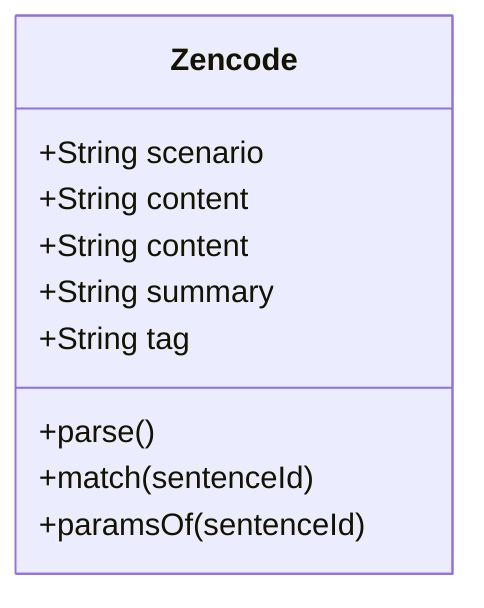

# @restroom-mw/zencode

This package is the package that handles all the interaction with the contracts.
Is an abstraction of the contract with some useful method to parse and handle actions.
The packace is used internally by the `@restroom-mw/core` middleware package, and is
useful in case you want to develop your own middleware.

# Reference

The export module is a class `Zencode`



## Usage

```js
import { Zencode } from "@restroom-mw/zencode";

const content = `
    rule check version 1.0.0
    rule unknown ignore
    Scenario storage: Save some random value inside a database
        Given I select '42' from 'table' where '1=1'
        and I have a database connection uri at 'sqlite://./database.db'
        and I have a valid 'string' in 'selected_value'
        When I create the array of '5' random objects of '256' bits
        Then print the 'array'
        and save the result into the database`;

const zencode = new Zencode(content);
```

## API

<!-- Generated by documentation.js. Update this documentation by updating the source code. -->

#### Table of Contents

-   [Zencode](#zencode)
    -   [Parameters](#parameters)
    -   [content](#content)
    -   [scenario](#scenario)
    -   [summary](#summary)
    -   [tag](#tag)
    -   [parse](#parse)
        -   [Examples](#examples)
    -   [match](#match)
        -   [Parameters](#parameters-1)
    -   [paramsOf](#paramsof)
        -   [Parameters](#parameters-2)
    -   [fromPath](#frompath)
        -   [Parameters](#parameters-3)
    -   [byName](#byname)
        -   [Parameters](#parameters-4)

### Zencode

[packages/zencode/src/index.ts:46-208](https://github.com/dyne/restroom-mw/blob/67c021e212417423b8d5bf317dbb559f007a8006/packages/zencode/src/index.ts#L46-L208 "Source code on GitHub")

#### Parameters

-   `content` **[string](https://developer.mozilla.org/docs/Web/JavaScript/Reference/Global_Objects/String)** 

**Meta**

-   **copyright**: 2020 Dyne.org

-   **author**: Puria Nafisi Azizi &lt;puria@dyne.org> @pna
-   **license**: AGPL-3.0-only

    A zencode class that encapsulated all related methods useful for
    using contracts in Restroom

#### content

[packages/zencode/src/index.ts:57-59](https://github.com/dyne/restroom-mw/blob/67c021e212417423b8d5bf317dbb559f007a8006/packages/zencode/src/index.ts#L57-L59 "Source code on GitHub")

The **Content** of the contract

Type: [string](https://developer.mozilla.org/docs/Web/JavaScript/Reference/Global_Objects/String)

#### scenario

[packages/zencode/src/index.ts:66-74](https://github.com/dyne/restroom-mw/blob/67c021e212417423b8d5bf317dbb559f007a8006/packages/zencode/src/index.ts#L66-L74 "Source code on GitHub")

The sentence that starts with `Scenario:` within the contract.
Returns [null](https://developer.mozilla.org/docs/Web/JavaScript/Reference/Global_Objects/null) if is not present

Type: [string](https://developer.mozilla.org/docs/Web/JavaScript/Reference/Global_Objects/String)

#### summary

[packages/zencode/src/index.ts:90-92](https://github.com/dyne/restroom-mw/blob/67c021e212417423b8d5bf317dbb559f007a8006/packages/zencode/src/index.ts#L90-L92 "Source code on GitHub")

Summary: the description that follows in the first line of the Scenario

Type: [string](https://developer.mozilla.org/docs/Web/JavaScript/Reference/Global_Objects/String)

#### tag

[packages/zencode/src/index.ts:99-103](https://github.com/dyne/restroom-mw/blob/67c021e212417423b8d5bf317dbb559f007a8006/packages/zencode/src/index.ts#L99-L103 "Source code on GitHub")

Tag: the very first word of the scenario used as tag to
aggregate contracts by scenario

Type: [string](https://developer.mozilla.org/docs/Web/JavaScript/Reference/Global_Objects/String)

#### parse

[packages/zencode/src/index.ts:154-169](https://github.com/dyne/restroom-mw/blob/67c021e212417423b8d5bf317dbb559f007a8006/packages/zencode/src/index.ts#L154-L169 "Source code on GitHub")

Creates a easy accessible data structure of the contract
In form of a [Map](https://developer.mozilla.org/docs/Web/JavaScript/Reference/Global_Objects/Map) (to ensure order). Each entry has the
key of the **sentenceId**.
A **sentenceId** is the contract line where the reserved
keywords are stripped away and all arguments (whatever is
inside a single quote) are replaced with `{}`.
All the transformation are case insensitive.

List of keywords (removed if the first word of a sentence):

-   `when`
-   `given`
-   `and`
-   `then`

List of ignored words (each occurence is removed):

-   `I`
-   `that`
-   `valid`
-   `known as`
-   `all`

Also these are aliased:

-   `inside` → `in`
-   `an` → `a`

The values of the [Map](https://developer.mozilla.org/docs/Web/JavaScript/Reference/Global_Objects/Map) are the parameters of the
**sentenceId** in form of an [Array](https://developer.mozilla.org/docs/Web/JavaScript/Reference/Global_Objects/Array)&lt;[String](https://developer.mozilla.org/docs/Web/JavaScript/Reference/Global_Objects/String)>

##### Examples

```javascript
const parsed = new Zencode(`rule check version 1.0.0
rule unknown ignore
Scenario simple: Some scenario description
Given nothing
When I create the array of '16' random objects of '32' bits
Then print all data`).parse()
console.log(parsed)
// Map(7) {
//   'rule check version 1.0.0' => [],
//   'rule unknown ignore' => [],
//   'Scenario simple: Some scenario description' => [],
//   'nothing' => [],
//   'create the array of {} random objects of {} bits' => [ '16', '32' ],
//   'print all data' => [],
//   '' => []
// }
```

Returns **[Map](https://developer.mozilla.org/docs/Web/JavaScript/Reference/Global_Objects/Map)&lt;[String](https://developer.mozilla.org/docs/Web/JavaScript/Reference/Global_Objects/String), [Array](https://developer.mozilla.org/docs/Web/JavaScript/Reference/Global_Objects/Array)&lt;[string](https://developer.mozilla.org/docs/Web/JavaScript/Reference/Global_Objects/String)>>** 

#### match

[packages/zencode/src/index.ts:176-178](https://github.com/dyne/restroom-mw/blob/67c021e212417423b8d5bf317dbb559f007a8006/packages/zencode/src/index.ts#L176-L178 "Source code on GitHub")

Test existence of a sentenceId within the contract

##### Parameters

-   `sentenceId` **[string](https://developer.mozilla.org/docs/Web/JavaScript/Reference/Global_Objects/String)** 

Returns **[boolean](https://developer.mozilla.org/docs/Web/JavaScript/Reference/Global_Objects/Boolean)** 

#### paramsOf

[packages/zencode/src/index.ts:185-187](https://github.com/dyne/restroom-mw/blob/67c021e212417423b8d5bf317dbb559f007a8006/packages/zencode/src/index.ts#L185-L187 "Source code on GitHub")

Return the parameters for a given sentenceId

##### Parameters

-   `sentenceId` **[string](https://developer.mozilla.org/docs/Web/JavaScript/Reference/Global_Objects/String)** 

Returns **[Array](https://developer.mozilla.org/docs/Web/JavaScript/Reference/Global_Objects/Array)&lt;[string](https://developer.mozilla.org/docs/Web/JavaScript/Reference/Global_Objects/String)>** 

#### fromPath

[packages/zencode/src/index.ts:194-197](https://github.com/dyne/restroom-mw/blob/67c021e212417423b8d5bf317dbb559f007a8006/packages/zencode/src/index.ts#L194-L197 "Source code on GitHub")

Create a [Zencode](#zencode) instance from the full path of the contract

##### Parameters

-   `path` **[string](https://developer.mozilla.org/docs/Web/JavaScript/Reference/Global_Objects/String)** 

Returns **[Zencode](#zencode)** 

#### byName

[packages/zencode/src/index.ts:205-207](https://github.com/dyne/restroom-mw/blob/67c021e212417423b8d5bf317dbb559f007a8006/packages/zencode/src/index.ts#L205-L207 "Source code on GitHub")

Create a [Zencode](#zencode) instance from the contract name without extension
from the given base directory

##### Parameters

-   `name` **[string](https://developer.mozilla.org/docs/Web/JavaScript/Reference/Global_Objects/String)** 
-   `basedir` **[string](https://developer.mozilla.org/docs/Web/JavaScript/Reference/Global_Objects/String)** 

Returns **[Zencode](#zencode)** 
