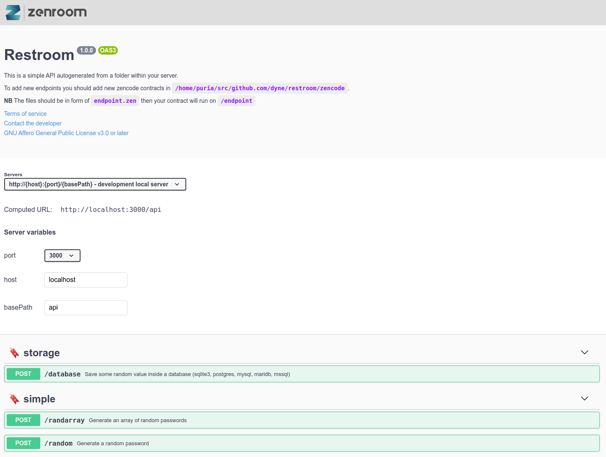

# Getting started

To start quickly there is a project template to start from, you need
[npx](https://www.npmjs.com/package/npx).

_npx is included with npm > v5.2 or can be installed separately_

```bash
npx degit dyne/restroom-template my-restroom
cd my-restroom
npm i
npm run start
```

if you point now your browser to http://localhost:3000/docs you'll
see a nice swagger page to play with your restroom and some fully
working example endpoints.


